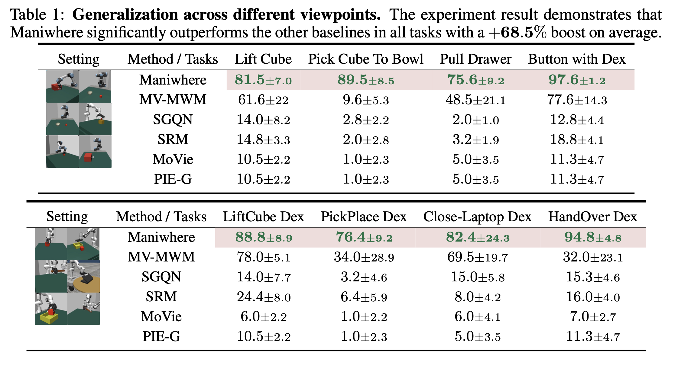
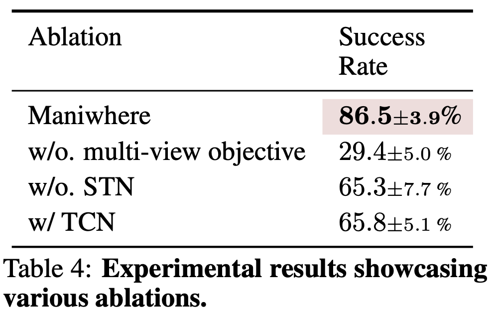
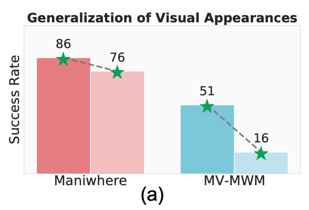
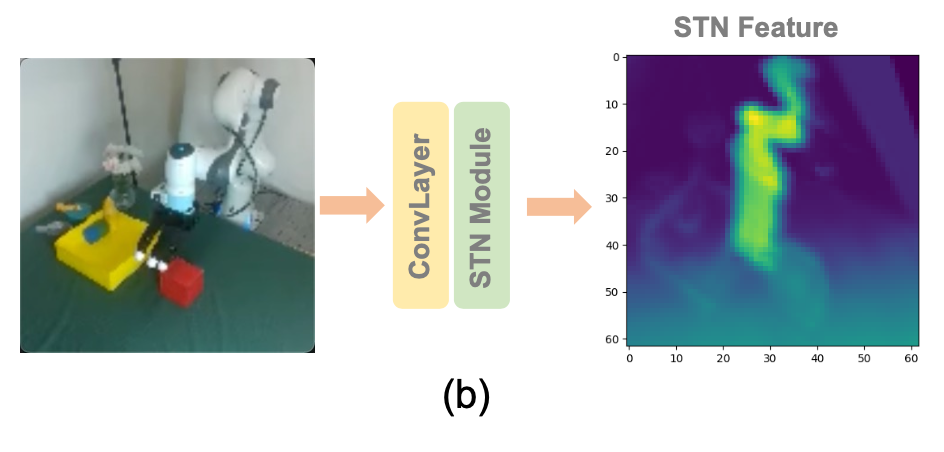

# 演讲内容

# 问题

通过强化学习的模型，在实际的任务场景中容易被突发的干扰项所影响正常的工作流程，使得任务通过率降低。而造成这个问题的原因是因为模型无法让不同硬件配置的设备（如摄像头、传感器等）协同合作，同时，在训练模型的时候所使用的模拟器数据和真实世界的任务执行环境存在差异，所以导致了该问题。

# 解决方案

该论文提出了 Maniwhere 框架来解决上述问题，该框架分为以下内容：

- 多视角表示学习
- STN（空间变换网络）
- 课程随机化
- 强化学习与奖励设计
- Sim2Real 转移
- 环境与任务设计

## 多视角表示学习

多视角表示学习指的是，使用固定在机器人不同位置，比如说左面、右面、正面等位置的摄像头，通过这些摄像头去搜集不同视角的数据。

这些数据在模型当中是以特征向量的形式表示出来。特征向量是一个数值数组，它包含了数据的关键信息，比如说图像的特征向量就包含了颜色、纹理、形状等的信息。

有了多视角表示就能够让模型获得来自不同摄像头不同的数据，使得模型能够对于物体有一个更加立体、全面的理解。

而“学习”指的是模型在不断的提取有用信息的过程，这样的学习能够让模型提升任务的执行准确率和泛化能力。

在 Maniwhere 中，会进行特征学习与对比学习。也就是将摄像头拍摄的图像中相似的元素进行对齐以及融合。

## STN（空间变换网络）

STN 是通过将图片进行平移、缩放、旋转等方式进行物体的建模，让模型理解物体与空间的关系。

具体的工作原理是：多视角表示学习提供了多个视角的图像。这些所提供的图像是在空间上变得一致，减少因为来自不同的视角所导致的图片差异，而 STN 获取到了这些图像之后对他们进行平移、缩放、旋转等方式，让他们在一个统一的空间中进行对齐和融合。

用简单的例子说明：桌上有一个水杯，机器人通过不同的视角拍摄到了水杯的不同视角的照片，多视角表示学习让他们在空间上变得一致，接着 STN 会根据这些图片将他们重新建模成水杯的样子，这个重新建模是使得模型能够理解这个水杯跟空间关系的重要过程。

## 课程随机化

课程随机化是 Maniwhere 中的一个重要的模块，它的主要是为了让模型能够适应更加复杂的环境而设计的，也就是让模型具备应变能力以及泛化能力。

传统的随机化会直接让模型进行随机扰动训练，而课程随机化的做法是让模型先从简单的环境开始进行训练。随着训练的进一步推进，会逐渐的加入更多不确定性以及干扰，通过这样渐进式的学习让模型更好的应对现实世界的环境。

论文中通过实验证实了课程随机化能够让模型在真实的环境中更好的应对各种扰动和硬件变化，同时这种训练方法也提高了模型从模拟环境到真实环境的迁移能力。

## 强化学习与奖励设计

在 Maniwhere 中强化学习的奖励被设计成是当完成一个步骤的时候就会有奖励的形式，而不是完成一整个任务才给奖励。对应的，当步骤失败的话就会被给予负奖励或者零奖励。

这样分布的奖励机制是发生在一些复杂的任务中的，比如说抓取的精以及物体移动的距离，都可能被分配到奖励。

这么做的目的是为了通过优化这些中间步骤使得最终的任务成功。

该奖励机制也与上述的课程随机化相关，当课程越来越复杂之后，会开始调整更加复杂的中间步骤奖励，对于简单扰动（比如说单一障碍物，或者小幅度的光照变化）的奖励则是发生在任务结束后。

## Sim2Real 转移

这一部分内容将在后续的实验中进行呈现。

## 环境与任务设计

这一部分内容将在后续的实验中进行呈现。

# 与现有的方法对比

Maniwhere 框架与几种主流的学习方法进行对比，主要是突出了其任务完成率、Sim2Real 转移以及训练稳定性方面的优势。

主要是与以下几种方式进行对比：

- 多视角多任务学习（MV-MWM）
- 模仿学习（MoVie）
- 像素重要性估计（PIE-G）
- SRM
- SGQN

## 多视角多任务学习（MV-MWM）

通过多视角以及多个任务同时学习的方式，提升模型在多任务时候的表现。

该方法以来来自不同位置摄像头的图像，通过不同的视角来增强模型的学习力。而该方法主要是将图形中的特征提取出来，再将这些图像在一个统一的空间中重新呈现出来。

但是该方法存在的挑战是，可能会存在因为不同视角所产生的一些特征分布差异，导致最终呈现出来的图形出现差异。

所以 Maniwhere 根据这个挑战引入了 STN 来解决这个问题。

## 模仿学习（MoVie）

模仿学习顾名思义是让机器学习专家所演示的一些数据来进行学习，主要是通过模仿人类专家的正确行为，尤其是学习动作预测任务。

但是这种方法容易受到示范数据和质量、数量的限制，所以专家可能无法涵盖所有的参数。

## 像素重要性估计（PIE-G）

而像素重要性估计是通过计算这些像素的重要性指导模型的学习。

这种方法主要是通过对于像素的重要性进行评估而做出策略，其优势在于能够让增强模型的视觉泛化能力。

但是其挑战在于当面临复杂的干扰时，其鲁棒性和稳定性相对较差，尤其是在处理多视角问题时候都很容易受到环境因素干扰。

# 实验

## 实验介绍（目的）

该实验是为了展示 Maniwhere 在不同视觉场景下的有效性，尤其是面对多重的视觉干扰项目所展示出的泛化能力。

实验主要是通过模拟环境与现实环境的对比，展现模型的通用性和适应能能力。

## 实验设计

### 任务

这个实验主要分为八个任务，这些任务都是基于 MuJoCo 引擎：

- Lift Cube → 抓去并抬起一个物品
- Pick Cube To Bowl  → 将立方体放入指定的碗中
- Pull Drawer Button with Dex → 使用灵巧手按下开关
- LiftCube Dex → 使用灵巧手对物体进行抓取和举起（更复杂的机械臂）
- PickPlace Dex  → 抓取和放置物品（更复杂的机械臂）
- Close-Laptop Dex → 关闭一台笔记本电脑盖子（灵巧手）
- HandOver Dex → 将物品从一个地方转移到另一个地方
- Pull Drawer Button → 按下开关

以上的任务涵盖以下特性说明了泛性：

- 单臂（single arm）
- 双臂（bi-manual arms）
- 灵巧手（dexterous hands）
- 可变形物体（articulated objects）

### 输入数据与任务配置

这个实验的一个重要组成部分是**Sim2Real（模拟到现实）的转移**，也就是说，当模型在模拟的环境中训练完之后就直接应用在现实的环境当中，具体的迁移过程如下：

在模拟的环境当中，使用来自两个不同摄像头的图像数据，一个摄像头是固定的，一个是在指定的范围内随机移动。这种视角差可以帮助模型从不同的角度去观察同一个场景的信息。

接着通过多视角表示学习，Maniwhere 模型能够将来自不同的视角的图像重新建模让模型理解。

那么在完成了模拟训练之后，训练好的模型就可以直接迁移到现实的环境中进行评估，不需要其他额外的训练或者调整。

## 实验结果

可以通过图表得知，Maniwhere 比其他方法平均都提升了 68.5% 的任务成功率。

## 模拟实验

该实验通过 50 个不同视角的实验来评估 Maniwhere 在多个任务中的表现，根据结果表明：都明显优于基准方法，尤其在面对相机视角变化时。

为了验证模型在不同硬件配置下的泛化能力，实验将 UR5e 机械臂替换为 Franka 机械臂。结果表明，Maniwhere 能够 零-shot 迁移到新的硬件（Franka 机械臂），并且仍然保持了对相机视角变化的泛化能力。

**Maniwhere** 在面对**视觉外观变化**时几乎没有表现下降

STN 能够将来自不同视角的图像通过空间变换对齐

# **消融实验（Ablation Studies）**

## 实验设计

该实验通过去除某些特定的模块进行实验，以证明这些模块在 Maniwhere 框架中的必要性。

## 评估方法

通过使用标准任务——上面表格中提到的 life cube 等的任务——的结果去评估去掉某些特定模块的表现，再进行性能差计算。

## 实验目的

该实验不仅仅是为了验证这些模块在 Maniwhere 框架中的必要性，同时也是为了验证这些模块在 Maniwhere 中不存在冗余的情况。

## 实验结果

通过图中的内容可以看出：

完成模型成功率：86.5±3.9%

去除多视角目标成功率：29.4±5.0%

去除 STN成功率：65.3±7.7%

使用 TCN：65.8±5.1%

通过这些数据我们能得出结论：多视角目标以及 STN 对于 Maniwhere 不存在冗余的情况，且是必要组件。同时引入了 TCN 进行对比，虽然说 TCN 在某些任务上提供了时序上的改进，但是相较于 Maniwhere 的完成模型而言提升率相对不高。

# **真实环境部署与硬件细节**

由于不同的传感器等设备会有不同的摆放位置、不同的精度以及模型对于他们的适配性的不同，计算平台的不同，如服务器、嵌入式计算平台等，以及执行器，比如说不同的机械臂等因素，导致模型在实际任务执行的时候产生更多的不确定性、影响任务通过率。

同时，在现实环境进行部署的时候还会遇到限制就是机器人的电池续航问题，如何在续航时间内完成任务；不同的机器人有不同的计算平台，这些计算平台之间存在算力差异；以及上述提及的传感器精度问题。

在真实的世界环境中，还会因为环境的变化所产生的不同的情况，软硬件之间的协同合作，以及模型反应的实时性问题。

## 如何部署

首先，搜集当下任务环境中的数据，让模型理解当下的环境，比如说物体形状、光照表面、物体运动等不确定的因素，让机器人对于这个环境有一个初步的了解。

根据这些数据后，让机器人在模拟的环境中去进行一个训练，对于模型进行微调。

通过人工将传感器和机器人进行物理部署后，模型就会开始进行多轮测试，评估模型表现。这些测试主要是通过任务成功率、执行时间以及系统稳定性所评估的。根据这些数据一步步的调整与传感器的关系，同时评估实时响应性。

# **局限性**

Maniwhere 在面对一些长时间跨度复杂任务的时候还是存在一些挑战，虽然说对于简单任务能够进行有效的 Sim2Real Transfer，但是面对长时间规划、多个步骤和复杂决策类型的任务时候还是会有限制。

那么针对这个挑战，未来可能会改进的方向是：

- 长期记忆增强：通过探索记忆**增强网络（Memory-augmented Networks） 或 长短期记忆（LSTM）**让模型能够更好的去维护长期的依赖内容，解决长时间规划中存在的短板
- 改进策略规划：可以尝试引入多阶段决策过程、层次强化学习等的方式来让模型更好的规划长期任务执行
- 模仿学习以及自监督学习：可以说通过模仿其他的智能体去增加自身经验