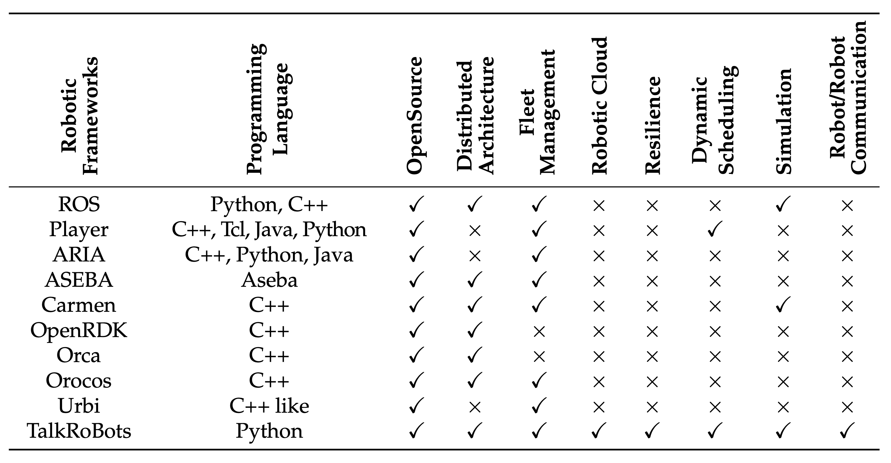
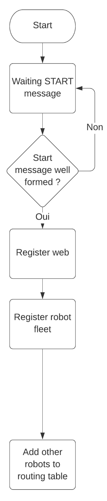
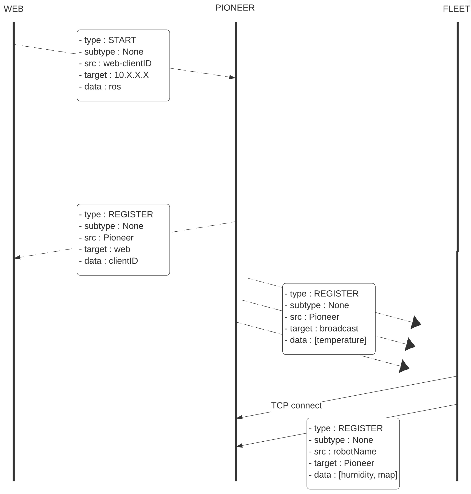
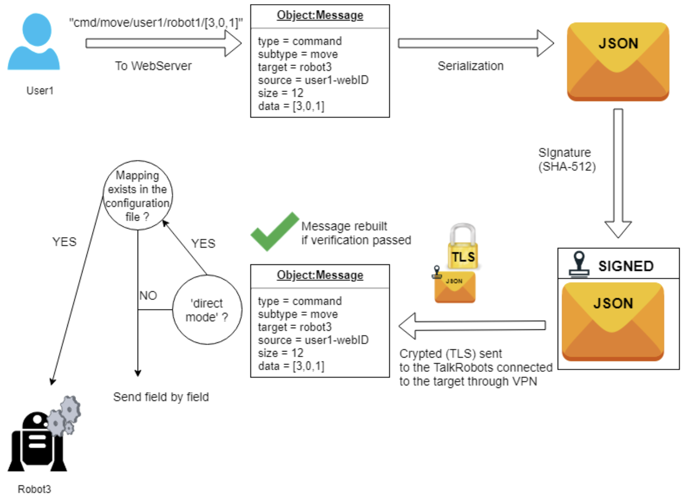
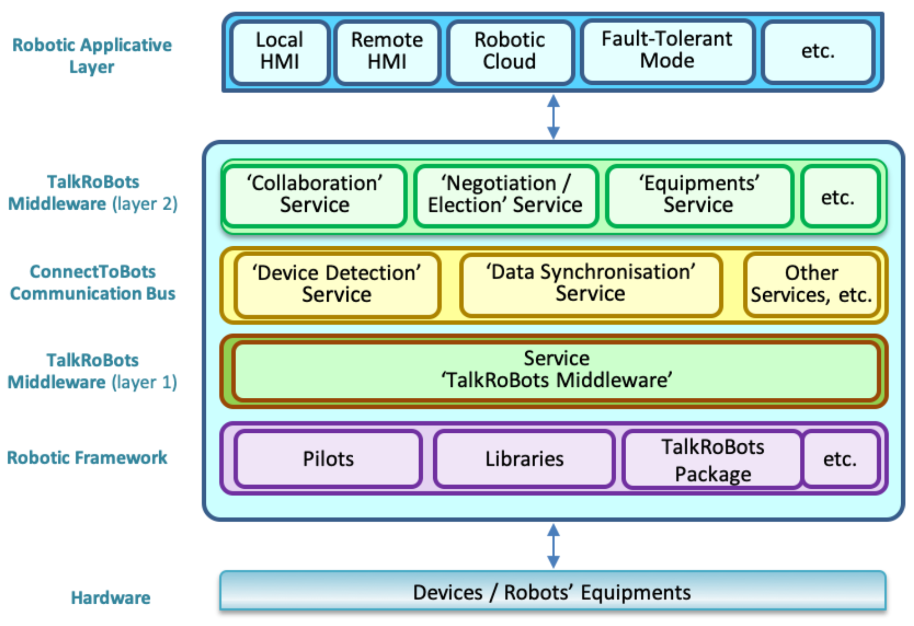
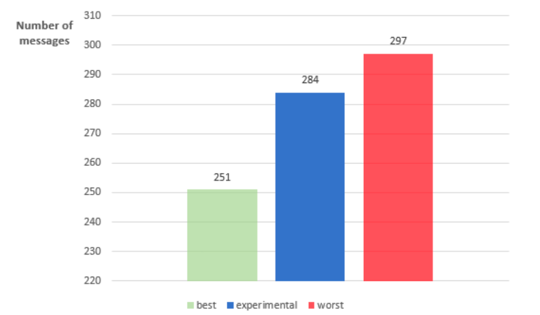
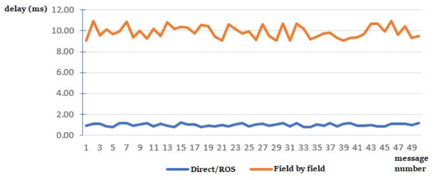

# TalkRoBots Paper share report

## TalkRoBots 定义及其背景

TalkRoBots 是一个能够让异构机器人进行沟通的一个中间件。

目前，在工业 4.0 的背景下，智能工厂发展迅速。在快速发展的过程中伴随着一定的难题，比如说，来自不同的制造商的机器人，使用着不同的编程语言，有着不同的预设，这会导致这些机器人无法进行通信，这对于智能工厂而言是致命的。

而 TalkRoBots 可以让上述来自不同制造商的机器人更加具有灵活性。

## 功能

TalkRoBots 的具体功能如下：

- 数据共享：让处于统一环境中的机器人能够共享来自工厂以及各机器人所配备的传感器中的数据。如湿度、灯光、温度、影像、声音等。
- 云服务器：TalkRoBots 中包含一个中央服务器，这个服务器能够让操作员更加灵活的去配置不同生产计划的生产场景。
- 监控：通过服务器，操作人员可以监控到机器人的状况，当生产场景出现故障时可以调用数据并且重新配置生产环境，保证生产效率。

其中，当故障发生的时候，服务器中的 AI 会基于 AHP（Analytic Hierarchy Process）去对目前的故障进行判断，并且自动调整目前的生产环境，保证任务不会中断。

## 对比



如上图所示，图表中列举了当前主流的框架，如 ROS、Player、ARLA、ASEBA 等。
在这个图表当中，可以注意到，首先 TalkRoBots 是一个开源的中间件，再者是基于 Python，而且它的特点在于指出云服务、场景自适应、允许让机器人之间通信（数据交换等）。

## 通信

### TalkRoBots 如何实现通信？

TalkRoBots 通过路由通信，让不同的机器人之间进行数据交换。

首先是有一个路由表，而这个路由表是每一个机器人都会有独立的一份，因为 TalkRoBots 的是去中心化的路由机制。

这个路由表存在于框架中的 Layer 1（后续会提及），而这个路由表包括了几个要素：

- TCP 套接字：每个机器人都通过 TCP 套接字与其他的机器人或者设备保持通信
- 机器人或者设备的 ID：上述的 TCP 套接字会与一个特定的机器人或者设备相关联，而机器人或者设备的 ID 就会记录在路由表当中，这样就能确保能够正确的找到每一个在路由表上的机器人或者设备。
- 传感器：同时路由表上还有记录连接不同机器人的传感器，这样就能够让路由表中所有的机器人都能够共享传感器的数据。


### 如何注册路由表？



1. 首先，当 start 消息开始后，系统会初始化机器人的注册过程
2. 接着，系统会接收到 start 消息，并且判断格式是否正确，如果不正确就会回到等待 start 消息的状态
3. 那么，如果 start 消息格式正确，就会进行 Web 注册，这样就能将机器人注册到远程监控或者控制的平台
4. 完成注册了之后，该机器人就会成为这个系统重的一部分
5. 最后，将这个机器人与其他车队中的机器人进行连接，将他们添加到路由表中，确保他们可以进行联系

### 路由表注册实例



首先， Web 向 Pioneer 发送 START 的消息
包含了以下信息：

```
Type: START
Subtype: None
Source (src): web-clientID
Target: 10.X.X.X
Data: ros
```

这条信息的意思是，向 IP 地址为 10.X.X.X 的 Pioneer 机器人发送一条 START 消息，并且指定使用框架。

接着，Pioneer 向 Web 发送 REGISTER 消息。

```
Type: REGISTER
Subtype: None
Source (src): Pioneer
Target: web
Data: clientID
```

接收到 START 消息后，Pioneer 开始返回一个注册消息，这表示该机器已经准备好并且正在与 Web Client 取得联系，这个消息中还包含了 Web 端的 ID，表明注册成功。

注册成功后，Pioneer 开始向车队中的其他机器人进行广播，告知他们 Pioneer 已经加入了车队，并且还具备温度传感器。

```
Type: REGISTER
Subtype: None
Source (src): Pioneer
Target: broadcast
Data: [temperature]
```

最后，其他车队与 Pioneer 建立 TCP 连接：

```
Type: REGISTER
Subtype: None
Source (src): robotName
Target: Pioneer
Data: [humidity, map]
```

其他的机器人开始与 Pioneer 取得联系，并且发送注册消息，比如说这个机器人就告知它具备湿度数据以及地图数据，以此类推在这个路由表中共享彼此的传感器数据，并且建立联系。

### 消息定义

上文中多次出现了如下格式的代码：

```
Type: 
Subtype: 
Source (src): 
Target:
Data: 
```

#### Type

这些就是 TalkRoBots 的信息格式，首先是消息类型（Message Type），分为命令（Command）、请求（Request）、信息（Information）。

#### Subtype

接着是，消息子类型（Message Subtype），子类型允许用户指定确切的命令、请求或者信息，比如说可以预设定位置或者温度，但是在 direct 或者 ros 模式下，子类型是需要根据配置文件进行定义，如果没有定义就会被 TalkRoBots 当做是普通字段处理。

#### Source (src)

Source（发送者）：这是一段字段，用于表示发送该信息的机器人。

#### Target

Target（目标）：该字段是用于表示接收信息机器人的 ID。

#### Data

Data（数据）：这是实际传输的数据部分

命令以及请求的消息会根据不同的模式（Direct or ROS mode）处理，这些模式下，消息直接发送给机器人而不通过 TalkRoBots。

如果是信息（Information），若机器人不能接收到字符串消息，则逐字发送到 TalkRoBots 中间件。

### 通信模式

TalkRoBots 的通信模式分为三种：Interpreter mode、Direct mode、ROS mode。

#### Interpreter mode

为了防止当机器人无法直接接收到消息，所以 TalkRoBots 会使用这个模式去对消息进行翻译。

通信流程：
1. 当 Robot1 需要与 Robot3 共享其位置信息的时候，Robot1 将位置信息[3,0,1]等数据直接发送给 TalkRoBots
2. TalkRoBots 将其序列化为 JSON 文件
3. 并且将这个 JSON 文件使用 SHA-512 哈希算法生成数字签名
4. 完成签名后消息会使用 TLS 进行加密
5. 签名和加密完成后的消息会通过 TalkRoBots 向 Robot3 传输
6. Robot3 接收到消息之后会进行解密并且重建为原始信息

这样的行为的好处在于，当需要扩展新的机器人的时候不用考虑其制造商以及使用的编程语言，也不需要去改动 TalkRoBots 的核心代码，体现其扩展性强。

#### Direct mode

如果目标消息是命令或者请求某一个机器人的时候，如果配置文件中有对应的映射文件，那么消息可以直接转换成机器人的语言命令并且直接执行。

比如说，用户发送了一个指令：`move`



那么相关的数据就会被序列化成 JSON 文件以及进行签名和加密，与 interpreter mode 中的相同，当机器人接收到信息的时候发现是直接模式并且配置文件已经存在了对应指令则可以直接执行。

#### ROS mode

ROS 模式中所执行的行为与直接模式中的一样，这两个模式的差别在于在最后的识别配置文件的时候，ROS 有自己专门的单元（Topic）。

## 框架



**TalkRoBots 第一层**：

该层是设计为一个网关，处理 “TalkRoBots 包” 以及 ConnectToBots 或者 TalkRoBots 第二层之间的消息转换。
允许机器人群中的异构机器人与外部设备之间进行透明和一致的通信，通过 ConnectToBots 处理机器人框架和第二层之间的消息交换。

**ConnectToBots 层**：

该层是通信总线，负责监控连接到机器人嵌入式 PC 的不同端口（如 USB、串口等），能够识别并且接收来自外部传感器和执行器（如温度传感器、摄像头、RFID 等）设备信息。
主要作用就是当一个机器人添加了一个新的功能，这一层会将这个功能拓展到整个机器人群中。

**TalkRoBots 第二层**：

这一层主要是包含了提供给操作人员开发的服务，比如说“Collaboration”以及“Negotiation”等，主要是负责在云端和机器人群之间共享数据。

## 实验

> 本实验旨在验证TalkRoBots中间件在实际制造场景中的有效性和功能性。


设备：
- Ridgeback 自动地面车辆（AGV）
- Sawyer 机器人（均运行ROS系统）、
- Universal Robot UR3 机械臂
- Pioneer 移动机器人
- Parrot 无人机
- 传送带
- 可编程逻辑控制器（PLC）

嵌入式软硬件环境：
- Raspberry Pi Model 3 B+
- Ubuntu Mate

> 机器人通过以太网连接到 Raspberry Pi。


### 实验流程

1. 任务接收与初始搬运

操作员通过云端应用向 Ridgeback AGV 发送任务指令。Ridgeback 接收到任务后，移动到位置1的工作台，拾取一个箱子，然后将其搬运至传送带入口处（位置2）。任务完成后，Ridgeback 向中间件发送任务完成确认信息，中间件随后将下一任务发送给下一个执行者（此处为传送带），并将确认信息转发至云端，使操作员能够实时了解任务进度。

2. 传送带运输

传送带启动，将箱子从位置 2 运输至位置 3 的工作台。运输完成后，传送带向 UR3 机械臂发送下一任务指令。 

3. 机械臂操作

UR3 机械臂从位置3的工作台上抓取箱子，并将其放置在自身附近的地面上。任务完成后，UR3向Ridgeback 发送下一任务指令。

4. 故障处理与替代

在 Ridgeback 准备执行下一任务时，模拟发生故障，导致其无法继续移动。系统通过中间件检测到故障后，向操作员的界面发送警报，提示 Ridgeback 的移动功能出现问题。中间件的容错机制会根据电池电量、位置和可用性等参数，推荐最佳的替代机器人。操作员在界面上选择 Pioneer 移动机器人作为替代。

5. 任务继续执行

替代机器人 Pioneer 移动至 UR3 的位置，接收并执行剩余的任务。随后，Pioneer 向 UR3 和 Parrot 无人机发送下一任务指令。UR3 再次执行任务，根据外部温度传感器的数据（高于或低于 20℃），从左侧或右侧拾取箱子。Parrot 无人机起飞，执行空中监测任务。任务完成后，二者均发送确认信息。

6. 任务收尾

Pioneer 返回到 Ridgeback 的位置，Ridgeback 在故障修复后，继续执行最后的任务，将箱子放置在其平台上。最终，Parrot 无人机接收到降落指令，Ridgeback 完成任务，系统结束。

### 结果



在本次实验中，共涉及 5 个机器人、1 个传感器和9个任务。实验过程中，共交换了 284 条消息。根据理论分析，考虑到可能的故障行为和参与的设备数量，消息交换的上下限分别为 251 条（最佳情况，无故障发生，任务由同一设备执行）和 297 条（最差情况，存在故障，需要替代设备，任务由不同设备依次执行）。实验结果与理论分析一致。

在数据传输方面，除向云端发送的转发消息和确认消息外，大部分消息的数据字段为空。因此，仅有 7 条消息的大小超过 32 字节（如确认消息约为 52 字节）。实验总共传输了 15.1 千字节的数据，耗时约 3 分钟，平均带宽为 83 B/s。该带宽消耗在工业环境中可以忽略不计，表明 TalkRoBots 中间件的通信开销非常低。



结果表明，解释器模式下，逐字段传输消息的延迟约为 10 毫秒，是直接模式（约 1.8 毫秒）的五倍。这主要是因为在解释器模式下，为防止 TCP 传输中多个字段被合并到同一缓冲区，需要在发送每个字段之间添加微小的延迟。